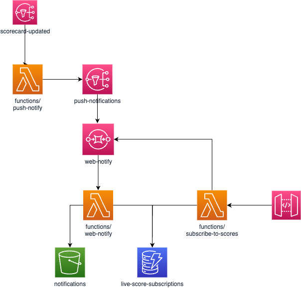

# Live Cricket Scores

## Introduction

This is the monorepo for the Live Cricket Scores Service. This service is built using an AWS event driven architecture to find HTML scorecards and publish updates to S3, web sockets, webpush whenever the scores are updated.

Source code is found under the `packages/` directory:

- `functions` for lambda functions entry points
- `libs` for common libraries that are used by apps

## Installation

This repo makes use of [Turbo Repo](https://turborepo.org/) and NPM workspaces to aid with monorepo setup.

Install:
`npm i`

Dependencies between commands can also be found in `turbo.json`

## Architecture Diagram

## Deployment

The service is deployed using [Terraform](https://www.terraform.io/). The definitions can be found in the `terraform` directory and the service is deployed by the `deploy.yml` GHA workflow every time main is updated.

The deployment workflow requires the following secrets in the Github repository:

- `AWS_ACCESS_KEY_ID` - AWS access key
- `AWS_SECRET_ACCESS_KEY` - AWS secret key
